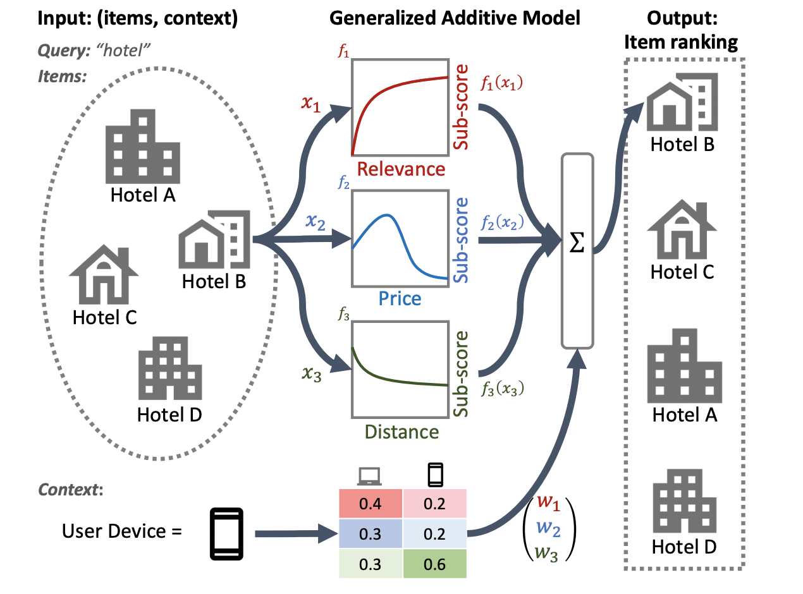

# TensorFlow Ranking Overview

The TensorFlow Ranking library helps you build scalable [learning to
rank](https://en.wikipedia.org/wiki/Learning_to_rank) machine learning models
using well-established approaches and techniques from recent research. A ranking
model takes a list of similar items, such as web pages, and generates an
optimized list of those items, for example most relevant to least relevant
pages. Learning to rank models have applications in search, question answering,
recommender systems, and dialogue systems. You can use this library to
accelerate building a ranking model for your application using the [Keras
API](../guide/keras/sequential_model). The Ranking library also provides workflow
utilities to make it easier to scale up your model implementation to work
effectively with large datasets using distributed processing strategies.

This overview provides a brief summary of developing learning to rank models
with this library, introduces some advanced techniques supported by the library,
and discusses the workflow utilities provided to support distributed processing
for ranking applications.

## Developing learning to rank models

Building model with the TensorFlow Ranking library follows these general steps:

1.  Specify a scoring function using Keras layers (`tf.keras.layers`)
1.  Define the metrics that you want to use for evaluation, such as
    `tfr.keras.metrics.NDCGMetric`
1.  Specify a loss function, such as `tfr.keras.losses.SoftmaxLoss`
1.  Compile the model with `tf.keras.Model.compile()` and train it with your
    data

The [Recommend movies tutorial](tutorials/quickstart) walks you through
the basics of building a learning to rank model with this library. Check out the
[Distributed ranking support](#distributed_ranking_support) section for more
information on building large-scale ranking models.

## Advanced ranking techniques

The TensorFlow Ranking library provides support for applying advanced ranking
techniques researched and implemented by Google researchers and engineers. The
following sections provide an overview of some of these techniques and how to
get started using them in your application.

### BERT list input ordering

The Ranking library provides an implementation of TFR-BERT, a scoring
architecture that couples
[BERT](https://ai.googleblog.com/2018/11/open-sourcing-bert-state-of-art-pre.html)
with LTR modeling to optimize the ordering
of list inputs. As an example application of this approach, consider a query and
a list of _n_ documents that you want to rank in response to this query. Instead
of learning a BERT representation scored independently across `<query,
document>` pairs, LTR models apply a [ranking
loss](https://www.microsoft.com/en-us/research/wp-content/uploads/2016/02/tr-2007-40.pdf)
to jointly learn a BERT representation that maximizes the utility of the entire
ranked list with respect to the ground-truth labels. The following figure
illustrates this technique:

<figure>
  
  <figcaption><b>Figure 1</b>: TensorFlow Ranking BERT architecture diagram
    showing a joint LTR model over a list of n documents using BERT
    representations of individual &lt;query,document&gt; pairs.</figcaption>
</figure>

This approach flattens a list of documents to rank in response to a query into a
list of `<query, document>` tuples. These tuples are then fed into a BERT
pre-trained language model. The pooled BERT outputs for the entire document list
are then jointly fine-tuned with one of the specialized
[ranking losses](https://github.com/tensorflow/ranking/blob/master/tensorflow_ranking/python/losses.py)
available in TensorFlow Ranking.

This architecture can deliver significant improvements in pretrained language
model performance, [producing](https://arxiv.org/abs/2004.08476)
state-of-the-art performance for several popular ranking tasks, especially when
multiple pretrained language models are combined. For more information on this
technique, see the related [research](https://arxiv.org/abs/2004.08476). You can
get started with a simple implementation in the TensorFlow Ranking
[example code](https://github.com/tensorflow/ranking/blob/master/tensorflow_ranking/examples/keras/tfrbert_antique_train.py).

### Neural Ranking Generalized Additive Models (GAM)

For some ranking systems, such as loan eligibility assessment, advertisement
targeting, or guidance for medical treatment, transparency and explainability
are critical considerations. Applying
[Generalized additive models](https://en.wikipedia.org/wiki/Generalized_additive_model)
(GAMs) with well-understood weighting factors can help your ranking model be
more explainable and interpretable.

GAMs have been extensively studied with regression and classification tasks, but
it is less clear how to apply them to a ranking application. For instance, while
GAMs can be simply applied to model each individual item in the list, modeling
both the item interactions and the context in which these items are ranked is a
more challenging problem. TensorFlow Ranking provides an implementation of
[neural ranking GAM](https://research.google/pubs/pub50040/), an extension of
generalized additive models designed for ranking problems. The TensorFlow
Ranking [implementation](api_docs/python/tfr/keras/layers/GAMLayer) of
GAMs allows you to add specific weighting to features of your model.

The following illustration of a hotel ranking system uses relevance, price, and
distance as primary ranking features. This model applies a GAM technique to
weigh these dimensions differently, based on the user's device context. For
example, if the query came from a phone, distance is weighted more heavily,
assuming users are looking for a nearby hotel.

<figure>
  
  <figcaption><b>Figure 2</b>: Applying neural ranking GAM for local search.
    For each input feature, such as price or distance, a sub-model produces
    a sub-score that can be examined, providing transparency. Context features
    like user device type can be used to determine the weights of sub-model
    scores.</figcaption>
</figure>

For more information on using GAMs with ranking models, see the related
[research](https://research.google/pubs/pub50040/). You can get started with a
sample implementation of this technique in the TensorFlow Ranking
[example code](https://github.com/tensorflow/ranking/blob/master/tensorflow_ranking/examples/keras/keras_m2e_gam_tfrecord_test.py).

## Distributed ranking support

TensorFlow Ranking is designed for building large-scale ranking systems end-to-
end: including data processing, model building, evaluation, and production
deployment. It can handle heterogeneous dense and sparse features, scale up to
millions of data points, and is designed to support [distributed
training](../guide/distributed_training) for large-scale
ranking applications.

<figure class="attempt-right">
  
  <figcaption><b>Figure 3</b>: Diagram of TensorFlow Ranking classes for 
    supporting distributed processing. The green modules can be customized 
    for your ranking model.</figcaption>
</figure>

The library provides an optimized ranking pipeline architecture, to avoid
repetitive, boilerplate code and create distributed solutions that can be
applied from training your ranking model to serving it. The ranking pipeline
supports most of TensorFlow's
[distributed strategies](../guide/distributed_training#types_of_strategies),
including
[MirroredStrategy](../guide/distributed_training#mirroredstrategy),
[TPUStrategy](../guide/distributed_training#tpustrategy),
[MultiWorkerMirroredStrategy](../guide/distributed_training#multiworkermirroredstrategy),
and
[ParameterServerStrategy](../guide/distributed_training#parameterserverstrategy).
The ranking pipeline can export the trained ranking model in the
`tf.saved_model` format, which supports several input
[signatures](../guide/saved_model#specifying_signatures_during_export)..
In addition, the Ranking pipeline provides useful callbacks, including support
for
[TensorBoard](../tensorboard)
data visualization and
[BackupAndRestore](../api_docs/python/tf/keras/callbacks/experimental/BackupAndRestore)
to help recover from failures in long-running training operations.

The ranking library assists with building a distributed training implementation
by providing a set of `tfr.keras.pipeline`
classes, which take a model builder, data builder, and hyperparameters as input.
The Keras-based `tfr.keras.ModelBuilder`
class enables you to create a model for distributed processing, and works with
extensible InputCreator, Preprocessor, and Scorer classes:

The TensorFlow Ranking pipeline classes also work with a
[DatasetBuilder](api_docs/python/tfr/keras/pipeline/BaseDatasetBuilder)
to set up training data, which can incorporate
[hyperparameters](api_docs/python/tfr/keras/pipeline/DatasetHparams).
Finally, the pipeline itself can include a set of hyperparameters as a
[PipelineHparams](api_docs/python/tfr/keras/pipeline/PipelineHparams)
object.

Get started with building distributed ranking models using the
[Distributed ranking tutorial](tutorials/ranking_dnn_distributed).
