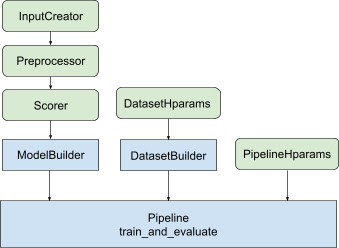

# Introduction to TensorFlow Ranking Pipeline

**TL;DR**: Reduce boilerplate code to build, train, and serve TensorFlow Ranking
models with TensorFlow Ranking Pipelines; Use proper distributed strategies for
large scale ranking applications given the use case and resources.

[TOC]

## Introduction

TensorFlow Ranking Pipeline consists of a series of data processing, model
building, training, and serving processes that allows you to construct, train,
and serve scalable neural network-based ranking models from data logs with
minimal efforts. The pipeline is most efficient when the system scales up. In
general, if your model takes 10 minutes or more to run on a single machine,
consider using this pipeline framework to distribute the load and speed up
processing.

The TensorFlow Ranking Pipeline has been constantly and stably run in large
scale experiments and productions with big data (terabytes+) and big models
(100M+ of FLOPs) on distributed systems (1K+ CPU and 100+ GPU and TPUs). Once a
TensorFlow model is proven with `model.fit` on a small part of the data, the
pipeline is recomended for hyper-parameter scanning, continuous training and
other large-scale situations.

### Ranking Pipeline

In TensorFlow, a typical pipeline to build, train, and serve a ranking model
includes the following typical steps.

-   Define model structure:
    -   Create inputs;
    -   Create pre-processing layers;
    -   Create neural network architecture;
-   Train model:
    -   Generate train and validation datasets from data logs;
    -   Prepare model with proper hyper-parameters:
        -   Optimizer;
        -   Ranking losses;
        -   Ranking Metrics;
    -   Configure
        [distributed strategies](https://www.tensorflow.org/tutorials/distribute/keras)
        to train across multiple devices.
    -   Configure
        [callbacks](https://www.tensorflow.org/api_docs/python/tf/keras/callbacks)
        for various bookkeeping.
    -   Export model for serving;
-   Serve model:
    -   Determine data format at serving;
    -   Choose and load trained model;
    -   Process with loaded model.

One of the main objectives of the TensorFlow Ranking pipeline is to reduce
boilerplate code in the steps, such as dataset loading and preprocessing,
compatibility of listwise data and pointwise scoring function, and model export.
The other important objective is to enforce the consistent design of many
inherently correlated processes, e.g., model inputs must be compatible with both
training datasets and data format at serving.

## Use Guide

With all the above design, launching a TF-ranking model falls into the following
steps, as shown in Figure 1.

<figure>
  
  <figcaption><b>Figure 1</b>: Diagram of TensorFlow Ranking classes and steps
    to train ranking models with the TF Ranking pipeline. The green modules can
    be customized for your ranking model.</figcaption>
</figure>

### Example using a distributed neural network

In this example, you will leverage the built-in
`tfr.keras.model.FeatureSpecInputCreator`,
`tfr.keras.pipeline.SimpleDatasetBuilder`, and
`tfr.keras.pipeline.SimplePipeline` that take in `feature_spec`s to consistently
define the input features in model inputs and dataset server. The notebook
version with a step-by-step walkthrough can be found in
[distributed ranking tutorial](tutorials/ranking_dnn_distributed.ipynb).

First define `feature_spec`s for both context and example features.

```
context_feature_spec = {}
example_feature_spec = {
    'custom_features_{}'.format(i + 1):
    tf.io.FixedLenFeature(shape=(1,), dtype=tf.float32, default_value=0.0)
    for i in range(10)
}
label_spec = ('utility', tf.io.FixedLenFeature(
    shape=(1,), dtype=tf.float32, default_value=-1))
```

Follow the steps illustrated in Figure 1: \
Define `input_creator` from `feature_spec`s.

```
input_creator = tfr.keras.model.FeatureSpecInputCreator(
    context_feature_spec, example_feature_spec)
```

Then define preprocessing feature transformations for the same set of input
features.

```
def log1p(tensor):
    return tf.math.log1p(tensor * tf.sign(tensor)) * tf.sign(tensor)
preprocessor = {
    'custom_features_{}'.format(i + 1): log1p
    for i in range(10)
}
```

Define scorer with built-in feedforward DNN model.

```
dnn_scorer = tfr.keras.model.DNNScorer(
    hidden_layer_dims=[1024, 512, 256],
    output_units=1,
    activation=tf.nn.relu,
    use_batch_norm=True,
    batch_norm_moment=0.99,
    dropout=0.4)
```

Make the `model_builder` with `input_creator`, `preprocessor`, and `scorer`.

```
model_builder = tfr.keras.model.ModelBuilder(
    input_creator=input_creator,
    preprocessor=preprocessor,
    scorer=dnn_scorer,
    mask_feature_name='__list_mask__',
    name='web30k_dnn_model')
```

Now set the hyperparameters for `dataset_builder`.

```
dataset_hparams = tfr.keras.pipeline.DatasetHparams(
    train_input_pattern='/path/to/MSLR-WEB30K-ELWC/train-*',
    valid_input_pattern='/path/to/MSLR-WEB30K-ELWC/vali-*',
    train_batch_size=128,
    valid_batch_size=128,
    list_size=200,
    dataset_reader=tf.data.RecordIODataset,
    convert_labels_to_binary=False)
```

Make the `dataset_builder`.

```
tfr.keras.pipeline.SimpleDatasetBuilder(
    context_feature_spec=context_feature_spec,
    example_feature_spec=example_feature_spec,
    mask_feature_name='__list_mask__',
    label_spec=label_spec,
    hparams=dataset_hparams)
```

Also set the hyperparameters for the pipeline.

```
pipeline_hparams = tfr.keras.pipeline.PipelineHparams(
    model_dir='/tmp/web30k_dnn_model',
    num_epochs=100,
    num_train_steps=100000,
    num_valid_steps=100,
    loss='softmax_loss',
    loss_reduction=tf.losses.Reduction.AUTO,
    optimizer='adam',
    learning_rate=0.0001,
    steps_per_execution=100,
    export_best_model=True,
    strategy='MirroredStrategy',
    tpu=None)
```

Make the `ranking_pipeline` and train.

```
ranking_pipeline = tfr.keras.pipeline.SimplePipeline(
    model_builder=model_builder,
    dataset_builder=dataset_builder,
    hparams=pipeline_hparams,
)
ranking_pipeline.train_and_validate()
```

## Design of TensorFlow Ranking Pipeline

The TensorFlow Ranking Pipeline helps save engineering time with boilerplate
code, at the same time, allows flexibility of customization through overriding
and subclassing. To achieve this, the pipeline introduces customizable classes
`tfr.keras.model.AbstractModelBuilder`,
`tfr.keras.pipeline.AbstractDatasetBuilder`, and
`tfr.keras.pipeline.AbstractPipeline` to set up the TensorFlow Ranking pipeline.

<figure>
  
  <figcaption><b>Figure 2</b>: Overall design of TensorFlow Ranking Pipeline
    classes.</figcaption>
</figure>

### ModelBuilder

The boilerplate code related to constructing the `Keras` model is integrated in
the `AbstractModelBuilder`, which is passed to the `AbstractPipeline` and called
inside the pipeline to build the model under the strategy scope. This is shown
in Figure 1. Class methods are defined in the abstract base class.

```
class AbstractModelBuilder:
  def __init__(self, mask_feature_name, name):

  @abstractmethod
  def create_inputs(self):
    // To create tf.keras.Input. Abstract method, to be overridden.
    ...
  @abstractmethod
  def preprocess(self, context_inputs, example_inputs, mask):
    // To preprocess input features. Abstract method, to be overridden.
    ...
  @abstractmethod
  def score(self, context_features, example_features, mask):
    // To score based on preprocessed features. Abstract method, to be overridden.
    ...
  def build(self):
    context_inputs, example_inputs, mask = self.create_inputs()
    context_features, example_features = self.preprocess(
        context_inputs, example_inputs, mask)
    logits = self.score(context_features, example_features, mask)
    return tf.keras.Model(inputs=..., outputs=logits, name=self._name)
```

You can directly subclass the `AbstractModelBuilder` and overwrite with the
concrete methods for customization, like

```
class MyModelBuilder(AbstractModelBuilder):
  def create_inputs(self, ...):
  ...
```

At the same time, you should use `ModelBuilder` with input features, preprocess
transformations, and scoring functions specified as function inputs
`input_creator`, `preprocessor`, and `scorer` in the class init instead of
subclassing.

```
class ModelBuilder(AbstractModelBuilder):
  def __init__(self, input_creator, preprocessor, scorer, mask_feature_name, name):
  ...
```

To reduce the boilerplates of creating these inputs, function classes
`tfr.keras.model.InputCreator` for `input_creator`,
`tfr.keras.model.Preprocessor` for `preprocessor`, and `tfr.keras.model.Scorer`
for `scorer` are provided, together with concrete subclasses
`tfr.keras.model.FeatureSpecInputCreator`,
`tfr.keras.model.TypeSpecInputCreator`, `tfr.keras.model.PreprocessorWithSpec`,
`tfr.keras.model.UnivariateScorer`, `tfr.keras.model.DNNScorer`, and
`tfr.keras.model.GAMScorer`. These should cover most of the common use cases.

Note that these function classes are Keras classes, so there is no need for
serialization. Subclassing is the recommended way for customizing them.

### DatasetBuilder

The `DatasetBuilder` class collects dataset related boilerplate. The data is
passed to the `Pipeline` and called to serve the training and validation
datasets and to define the serving signatures for saved models. As shown in
Figure 1, the `DatasetBuilder` methods are defined in the
`tfr.keras.pipeline.AbstractDatasetBuilder` base class,

```
class AbstractDatasetBuilder:

  @abstractmethod
  def build_train_dataset(self, *arg, **kwargs):
    // To return the training dataset.
    ...
  @abstractmethod
  def build_valid_dataset(self, *arg, **kwargs):
    // To return the validation dataset.
    ...
  @abstractmethod
  def build_signatures(self, *arg, **kwargs):
    // To build the signatures to export saved model.
    ...
```

In a concrete `DatasetBuilder` class, you must implement
`build_train_datasets`,`build_valid_datasets` and `build_signatures`.

A concrete class that makes datasets from `feature_spec`s is also provided:

```
class BaseDatasetBuilder(AbstractDatasetBuilder):

  def __init__(self, context_feature_spec, example_feature_spec,
               training_only_example_spec,
               mask_feature_name, hparams,
               training_only_context_spec=None):
    // Specify label and weight specs in training_only_example_spec.
    ...
  def _features_and_labels(self, features):
    // To split the labels and weights from input features.
    ...

  def _build_dataset(self, ...):
    return tfr.data.build_ranking_dataset(
        context_feature_spec+training_only_context_spec,
        example_feature_spec+training_only_example_spec, mask_feature_name, ...)

  def build_train_dataset(self):
    return self._build_dataset(...)

  def build_valid_dataset(self):
    return self._build_dataset(...)

  def build_signatures(self, model):
    return saved_model.Signatures(model, context_feature_spec,
                                  example_feature_spec, mask_feature_name)()
```

The `hparams` that are used in the `DatasetBuilder` are specified in the
`tfr.keras.pipeline.DatasetHparams` dataclass.

### Pipeline

The Ranking Pipeline is based on the `tfr.keras.pipeline.AbstractPipeline`
class:

```
class AbstractPipeline:

  @abstractmethod
  def build_loss(self):
    // Returns a tf.keras.losses.Loss or a dict of Loss. To be overridden.
    ...
  @abstractmethod
  def build_metrics(self):
    // Returns a list of evaluation metrics. To be overridden.
    ...
  @abstractmethod
  def build_weighted_metrics(self):
    // Returns a list of weighted metrics. To be overridden.
    ...
  @abstractmethod
  def train_and_validate(self, *arg, **kwargs):
    // Main function to run the training pipeline. To be overridden.
    ...
```

A concrete pipeline class that trains the model with different
`tf.distribute.strategy`s compatible with `model.fit` is also provided:

```
class ModelFitPipeline(AbstractPipeline):

  def __init__(self, model_builder, dataset_builder, hparams):
    ...
  def build_callbacks(self):
    // Builds callbacks used in model.fit. Override for customized usage.
    ...
  def export_saved_model(self, model, export_to, checkpoint=None):
    if checkpoint:
      model.load_weights(checkpoint)
    model.save(export_to, signatures=dataset_builder.build_signatures(model))

  def train_and_validate(self, verbose=0):
    with self._strategy.scope():
      model = model_builder.build()
      model.compile(
          optimizer,
          loss=self.build_loss(),
          metrics=self.build_metrics(),
          loss_weights=self.hparams.loss_weights,
          weighted_metrics=self.build_weighted_metrics())
      train_dataset, valid_dataset = (
          dataset_builder.build_train_dataset(),
          dataset_builder.build_valid_dataset())
      model.fit(
          x=train_dataset,
          validation_data=valid_dataset,
          callbacks=self.build_callbacks(),
          verbose=verbose)
      self.export_saved_model(model, export_to=model_output_dir)
```

The `hparams` used in the `tfr.keras.pipeline.ModelFitPipeline` are specified in
the `tfr.keras.pipeline.PipelineHparams` dataclass. This `ModelFitPipeline`
class is sufficient for most TF Ranking use cases. Clients can easily subclass
it for specific purposes.

### Distributed Strategy support

Please refer to
[distributed training](https://www.tensorflow.org/guide/distributed_training)
for a detailed introduction of TensorFlow supported distributed strategies.
Currently, the TensorFlow Ranking pipeline supports
`tf.distribute.MirroredStrategy` (default), `tf.distribute.TPUStrategy`,
`tf.distribute.MultiWorkerMirroredStrategy`, and
`tf.distribute.ParameterServerStrategy`. Mirrored strategy is compatible with
most of the single machine systems. Please set `strategy` to `None` for no
distributed strategy.

In general, `MirroredStrategy` works for relatively small models on most devices
with CPU and GPU options. `MultiWorkerMirroredStrategy` works for big models
that do not fit in one worker. `ParameterServerStrategy` does asynchronous
training and requires multiple workers available. `TPUStrategy` is ideal for big
models and big data when TPUs are available, however, it is less flexible in
terms of the tensor shapes it can handle.

## FAQs

1.  The minimal set of components for using the `RankingPipeline` \
    See [example code](#heading=h.79gptegfx5t6) above.

2.  What if I have my own Keras `model` \
    To be trained with `tf.distribute` strategies, `model` needs to be
    constructed with all trainable variables defined under the strategy.scope().
    So wrap your model in `ModelBuilder` as,

```
class MyModelBuilder(AbstractModelBuilder):
  def __init__(self, model, context_feature_names, example_feature_names,
               mask_feature_name, name):
    super().__init__(mask_feature_name, name)
    self._model = model
    self._context_feature_names = context_feature_names
    self._example_feature_names = example_feature_names

  def create_inputs(self):
    inputs = self._model.input
    context_inputs = {inputs[name] for name in self._context_feature_names}
    example_inputs = {inputs[name] for name in self._example_feature_names}
    mask = inputs[self._mask_feature_name]
    return context_inputs, example_inputs, mask

  def preprocess(self, context_inputs, example_inputs, mask):
    return context_inputs, example_inputs, mask

  def score(self, context_features, example_features, mask):
    inputs = dict(
        list(context_features.items()) + list(example_features.items()) +
        [(self._mask_feature_name, mask)])
    return self._model(inputs)

model_builder = MyModelBuilder(model, context_feature_names, example_feature_names,
                               mask_feature_name, "my_model")
```

Then feed in this model_builder to the pipeline for further training.
